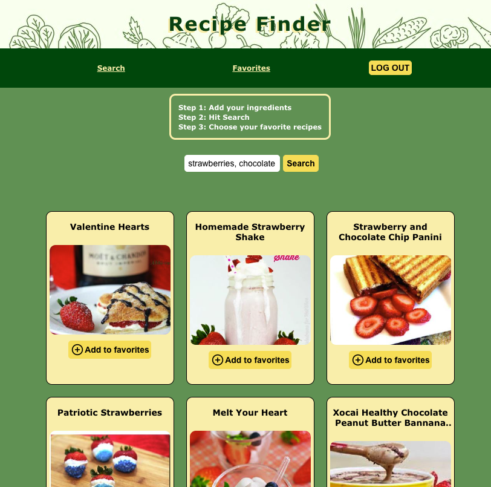

# Recipe-Finder

A website to help you find what recipes you can make with the ingredients you already have in your kitchen.

Complete CRUD app created with the MERN stack (MongoDB, Express, React, and Node JS).  

Check out the live site, deployed on render: https://recipe-finder.onrender.com/  

## Installation:  

1. Clone the repository  
git clone https://github.com/yourusername/recipe-finder.git

2. Install dependencies  
npm install

3. Start the server  
npm start

4. Visit http://localhost:3000 to view the app in your browser.  

5. Create a build directory for deployment  
npm run build

## Features:

- Implemented User Authentication and Authorization with JSON web token and bcrypt
- Pulled data from spoonacular's food API
- Users can add recipes to their favorites page
- Utilized fetch requests with async/await functions, useState, and react-router-dom

## Dependencies:
    "@testing-library/jest-dom": "^5.16.5",
    "@testing-library/react": "^13.4.0",
    "@testing-library/user-event": "^13.5.0",
    "bcrypt": "^5.1.0",
    "body-parser": "^1.20.1",
    "dotenv": "^16.0.3",
    "express": "^4.18.2",
    "jsonwebtoken": "^9.0.0",
    "mongoose": "^6.8.2",
    "morgan": "^1.10.0",
    "react": "^18.2.0",
    "react-dom": "^18.2.0",
    "react-icons": "^4.7.1",
    "react-router-dom": "^6.6.1",
    "react-scripts": "5.0.1",
    "serve-favicon": "^2.5.0",
    "web-vitals": "^2.1.4"

